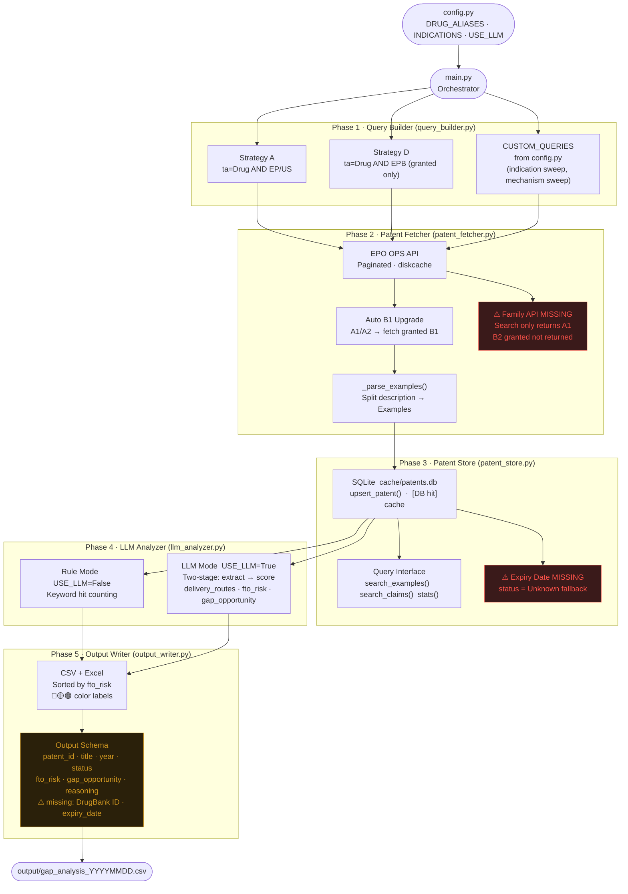

# Prior Art Tool — System Architecture

> Drug Repurposing Patent Analyzer · Current State  
> Last updated: 2025-04 (updated after Pemirolast × IPF validation run)

---

## Overview

Five-phase pipeline: config → query → fetch → store → analyze → output.  
Each phase has a distinct responsibility and a clear handoff to the next.

---

## End-to-End Data Flow



---

## Module Responsibilities

| Module | Path | Responsibility |
|--------|------|----------------|
| Config | `config.py` | All parameters in one place — only file to touch when switching projects |
| Query Builder | `modules/query_builder.py` | Generate EPO CQL search strings (Strategy A, D, + CUSTOM_QUERIES) |
| Patent Fetcher | `modules/patent_fetcher.py` | Call EPO OPS API, paginate, parse examples, auto-upgrade A1→B1 |
| Patent Store | `modules/patent_store.py` | SQLite local cache; cross-project persistent store |
| LLM Analyzer | `modules/llm_analyzer.py` | Rule-based or two-stage LLM FTO scoring |
| Output Writer | `modules/output_writer.py` | Sort, filter, write CSV + color-coded Excel |

---

## Fetch Priority Logic

```
① Check local patents.db  →  [DB hit] return immediately
        ↓ miss
② EPO OPS API  →  title / abstract / claims / description
        ↓
③ _parse_examples()  →  slice Examples section from description
        ↓
④ upsert_patent()  →  write to SQLite
        ↓
⑤ If A1/A2  →  auto-fetch corresponding B1 (complete claims)
        ↓
⑥ ⚠ Family members NOT fetched  →  B2 granted version missed
```

---

## EPO OPS Data Coverage

| Patent Type | title/abstract | claims | description/examples | Search indexing |
|-------------|:--------------:|:------:|:--------------------:|:---------------:|
| EP granted (EPB) | ✅ | ✅ | ✅ | ✅ |
| EP application (A1/A2) | ✅ | ❌ | partial | ✅ representative |
| US application (A1) | ✅ | ❌ | ❌ | ✅ representative |
| US granted (B1/B2) | ✅ | partial | partial | ⚠️ not in search |
| WO / AU / CN / MX | partial | ❌ | ❌ | partial |

**Key insight from Pemirolast × IPF validation:**
EPO search returns the **representative publication** of a patent family (usually A1).
The granted B2 has a **different patent number** and will NOT appear in search results,
even though `_get_or_fetch(B2_id)` can retrieve it directly.

---

## Gap Analysis

### Current Status

| # | Gap | Location | Priority | Impact | Found in |
|---|-----|----------|----------|--------|----------|
| 1 | Patent family not expanded | `patent_fetcher.py` | **P1** | Misses granted B2; underestimates FTO risk | Pemirolast × IPF run |
| 2 | Auto-upgrade only handles B1, not B2 | `patent_fetcher.py` `_get_or_fetch()` | **P1** | US patents often use B2 kind code | Pemirolast × IPF run |
| 3 | Single-drug config only | `config.py` + `main.py` | **P1** | Cannot batch-process drug candidate lists from bio team | Architecture review |
| 4 | Patent expiry date not calculated | `patent_store.py` | **P1** | Cannot filter out expired patents | Architecture review |
| 5 | Rule mode delivery_routes / indications hardcoded | `llm_analyzer.py` | **P2** | Fields show config values, not text-extracted | Pemirolast × IPF run |
| 6 | AU / TW / KR coverage poor | EPO OPS data source | **P2** | Non-EP/US patents often missed | Pemirolast × IPF run |
| 7 | Output missing `drugbank_id` / `expiry_date` | `output_writer.py` | **P2** | Hard to join with bio team schema | Architecture review |
| 8 | Toxicity filtering absent | new module needed | **P2** | Filter step incomplete vs. SOP requirement | Architecture review |
| 9 | No REST API endpoint | new `api/` layer | **P3** | Bio team cannot call programmatically | Architecture review |

### Roadmap

```
P1  Search recall improvement
    ├── Add EPO family API call after each A1 fetch
    │   → auto-discover and store all family members including B2
    ├── Extend auto-upgrade to try B1 and B2
    │   _get_or_fetch: if kind in (A1, A2) → try B1, then B2
    ├── Accept drug list CSV as input (replace single config entry)
    └── Add expiry_date field + auto-calculation in patent_store.py

P2  Quality and coverage
    ├── Fix rule mode: extract delivery_routes / indications from text
    │   instead of returning hardcoded config values
    ├── Add drugbank_id / expiry_date to output schema
    └── New toxicity_filter module (FDA FAERS or DrugBank)

P3  System integration
    └── REST API layer so bio team pipeline can call programmatically
```

---

## Known Limitations (Validated)

### EPO Search Does Not Return Granted B2 Publications

**Reproduced by:** `tests/test_epo_search_vs_fetch.py`

```
Query:  ta=cromolyn AND ta="pulmonary fibrosis"
Search returns:  US2019224161A1, US2018193259A1   ← A1 representative
Missing:         US10561635B2, US10583113B2        ← granted B2, different number

Direct fetch:    _get_or_fetch("US10561635B2") → title + abstract OK
```

Root cause: EPO OPS search indexes one representative publication per family.
The granted B2 has a different patent number than the A1 — this is not a kind-code
difference but a patent family issue. Requires EPO family API to discover all members.

Workaround (short term): Manually import known missing patents by ID using `_get_or_fetch`.

Fix (P1): After fetching any A1, call EPO family API to retrieve all family members.

---

## Validation Log

| Date | Drug × Indication | Config | Patents found | FTO result | Notes |
|------|-------------------|--------|---------------|------------|-------|
| 2025-04 | Roflumilast × SCA | original | — | baseline | original project |
| 2025-04 | Pemirolast × IPF | `config_pemirolast_ipf.py` | 249 | 0 High / 22 Medium | P0 ✅; B2 gap found |

---

## Notes

- This tool is a **radar, not legal advice**. High/Medium risk patents still require claim construction by a patent attorney.
- EPO OPS weekly quota: **3.5 GB**. `cache/epo/` (diskcache) prevents redundant API calls.
- Re-running `main.py` is safe — patents already in `patents.db` take the `[DB hit]` path.
- Claims text truncated at `CLAIMS_MAX_CHARS` (default 3000) — adjust in `config.py`.