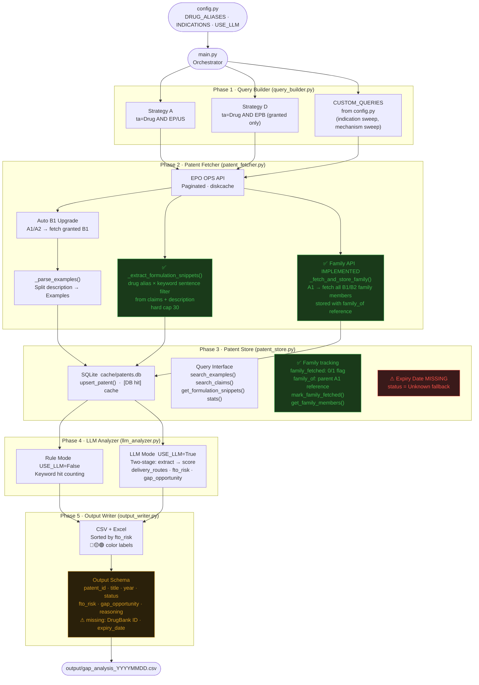

# Prior Art Tool — System Architecture

> Drug Repurposing Patent Analyzer · Current State  
> Last updated: 2026-05 (Task A: formulation snippet extraction)

---

## Overview

Five-phase pipeline: config → query → fetch → store → analyze → output.  
Each phase has a distinct responsibility and a clear handoff to the next.

---

## End-to-End Data Flow



---

## Module Responsibilities

| Module | Path | Responsibility |
|--------|------|----------------|
| Config | `config.py` | All parameters in one place — only file to touch when switching projects |
| Query Builder | `modules/query_builder.py` | Generate EPO CQL search strings (Strategy A, D, + CUSTOM_QUERIES) |
| Patent Fetcher | `modules/patent_fetcher.py` | Call EPO OPS API, paginate, parse examples, extract formulation snippets, auto-upgrade A1→B1, expand family |
| Patent Store | `modules/patent_store.py` | SQLite local cache; family tracking; formulation snippet storage; cross-project persistent store |
| LLM Analyzer | `modules/llm_analyzer.py` | Rule-based or two-stage LLM FTO scoring |
| Output Writer | `modules/output_writer.py` | Sort, filter, write CSV + color-coded Excel |

---

## Fetch Priority Logic

```
① Check local patents.db  →  [DB hit]
        │
        ├─ If A1/A2 and family_fetched=0  →  call _fetch_and_store_family()
        │       → EPO family API → fetch all B1/B2 members
        │       → upsert with family_of = parent A1
        │       → mark_family_fetched(parent)
        │
        ├─ If A1/A2 and family_fetched=1  →  [family DB hit]
        │       → get_family_members() from DB (no API call)
        │
        └─ return patent + _family_members
        ↓ miss
② EPO OPS API  →  title / abstract / claims / description
        ↓
③ _parse_examples()  →  slice Examples section from description
        ↓
③b _extract_formulation_snippets()  →  drug × keyword sentences
        from claims (priority) + description, hard cap 30
        ↓
④ upsert_patent()  →  write to SQLite (incl. formulation_snippets as JSON)
        ↓
⑤ If A1/A2  →  auto-fetch B1 (same number, kind code swap)
        ↓
⑥ If A1/A2  →  _fetch_and_store_family()
              → EPO family API → all B1/B2 with different numbers
              → stored with family_of reference
              → mark_family_fetched()
```

---

## EPO OPS Data Coverage

| Patent Type | title/abstract | claims | description/examples | Search indexing |
|-------------|:--------------:|:------:|:--------------------:|:---------------:|
| EP granted (EPB) | ✅ | ✅ | ✅ | ✅ |
| EP application (A1/A2) | ✅ | ❌ | partial | ✅ representative |
| US application (A1) | ✅ | ❌ | ❌ | ✅ representative |
| US granted (B1/B2) | ✅ | partial | partial | ⚠️ not in search, found via family API |
| WO / AU / CN / MX | partial | ❌ | ❌ | partial |

**Key insight from Pemirolast × IPF validation:**
EPO search returns the **representative publication** of a patent family (usually A1).
The granted B2 has a **different patent number** — requires EPO family API to discover.
Family API call: `client.family("publication", Epodoc(number_without_kind), None, ["biblio"])`

---

## Patent Store Schema

```sql
CREATE TABLE patents (
    patent_id            TEXT PRIMARY KEY,
    title                TEXT,
    abstract             TEXT,
    claims               TEXT,
    examples_extracted   TEXT,    -- Examples section (full)
    formulation_snippets TEXT,    -- JSON list: drug × keyword sentences (≤30)
    status               TEXT,
    year                 TEXT,
    source               TEXT,
    fetched_at           TEXT,
    family_fetched       INTEGER DEFAULT 0,
    family_of            TEXT
);
```

Key functions added:
- `mark_family_fetched(patent_id)` — mark A1 as expanded
- `get_family_members(patent_id)` — get all members where `family_of = patent_id`
- `get_formulation_snippets(patent_id)` — return parsed list of formulation sentences

Note: `examples_extracted` and `formulation_snippets` are complementary —
`examples_extracted` keeps the full Examples section for FTO analysis;
`formulation_snippets` keeps targeted drug × keyword sentences for formulation evidence.
Pre-Task-A rows have `formulation_snippets = NULL` pending backfill.

---

## Gap Analysis

### Current Status

| # | Gap | Location | Priority | Status | Notes |
|---|-----|----------|----------|--------|-------|
| 1 | Patent family not expanded | `patent_fetcher.py` | **P1** | ✅ Fixed | family API implemented 2025-05 |
| 2 | Pre-existing family members missing family_of | `patent_fetcher.py` | **P1** | ✅ Fixed | backfill on re-process |
| 3 | backfill_family_of.py for old DB records | new script | **P1** | ⚠️ Pending | 4 known affected patents |
| 3b | backfill_formulation_snippets.py for pre-Task-A rows | new script | **P2** | ⚠️ Pending | NULL on rows fetched before 2026-05 |
| 3c | `_fetch_claims` returns empty (404 on /epodoc/claims) | `patent_fetcher.py` | **P1** | ❌ Open | affects `claims`, `examples_extracted`, `formulation_snippets` coverage; regex sentence splitter fails on multi-clause claim structures (a) / b) enumeration) |
| 4 | Single-drug config only | `config.py` + `main.py` | **P1** | ❌ Open | bio team pipeline blocker |
| 5 | Patent expiry date not calculated | `patent_store.py` | **P1** | ❌ Open | status = Unknown fallback |
| 6 | Rule mode delivery_routes / indications hardcoded | `llm_analyzer.py` | **P2** | ❌ Open | config values not text-extracted |
| 7 | AU / TW / KR coverage poor | EPO OPS data source | **P2** | ❌ Open | non-EP/US patents missed |
| 8 | Output missing `drugbank_id` / `expiry_date` | `output_writer.py` | **P2** | ❌ Open | bio team schema mismatch |
| 9 | Toxicity filtering absent | new module needed | **P2** | ❌ Open | deprioritized by bio team |
| 10 | No REST API endpoint | new `api/` layer | **P3** | ❌ Open | bio team integration |

### Roadmap

```
P1  Next up
    ├── backfill_family_of.py
    │   → for patents with family_fetched=1 but members have family_of=NULL
    │   → re-run family API and update family_of
    ├── Accept drug list CSV as input
    └── Add expiry_date field + auto-calculation

P2  Quality and coverage
    ├── Fix rule mode: extract delivery_routes / indications from text
    ├── Add drugbank_id / expiry_date to output schema
    └── New toxicity_filter module (deprioritized by bio team)

P3  System integration
    └── REST API layer
```

---

## Known Limitations

### EPO Family API — Correct Call Signature

```python
# CORRECT: Epodoc without kind code
resp = client.family(
    "publication",
    epo_ops.models.Epodoc(number),  # no kind code
    None,
    ["biblio"]
)

# WRONG: causes URL duplication bug in epo_ops library
resp = client.family(
    reference_type="publication",
    input=epo_ops.models.Epodoc(number, kind),  # kind code causes bug
    endpoint="biblio",
)
```

**Reproduced by:** `tests/test_family_api.py`

### Pre-existing Family Members (family_of=NULL)

Patents stored before `family_of` field was introduced have `family_of=NULL`.
These are invisible to `get_family_members()`.

Re-processing the parent A1 will now automatically backfill `family_of` for these members.

**Currently affected (4 patents):**
- `EP2443120B1` — Crystalline form of Pemirolast
- `EP2107907B1` — Pemirolast + ramatroban combination
- `EP1285921B1` — Pemirolast preparation process
- `NO20210693B1` — Capsaicin × IPF

---

## Validation Log

| Date | Drug × Indication | Config | Patents found | FTO result | Notes |
|------|-------------------|--------|---------------|------------|-------|
| 2025-04 | Roflumilast × SCA | `configs/roflumilast_sca.py` | — | baseline | original project |
| 2025-04 | Pemirolast × IPF | `configs/pemirolast_ipf.py` | 249 | 0 High / 22 Medium | P0 ✅; B2 gap found |
| 2025-05 | Pemirolast × IPF | `configs/pemirolast_ipf.py` | 293 | — | family API implemented; +44 patents vs prev run |
| 2026-05 | Acetaminophen × formulation evidence | `configs/acetaminophen_formulation_evidence.py` | — | Task A verified | snippet extraction added; `_fetch_claims` 404 bug surfaced as blocker for full validation |

---

## Test Scripts

| Script | Purpose |
|--------|---------|
| `tests/test_epo_search_vs_fetch.py` | Reproduces B2 missing from search results |
| `tests/test_family_api.py` | Validates EPO family API call signature and response parsing |
| `tests/test_formulation_snippets.py` | Regression tests for `_extract_formulation_snippets` — drug × keyword filter, alias matching, cap, JSON-serializability |

---

## Notes

- This tool is a **radar, not legal advice**. High/Medium risk patents still require claim construction by a patent attorney.
- EPO OPS weekly quota: **3.5 GB**. `cache/epo/` (diskcache) prevents redundant API calls.
- Re-running `main.py` is safe — patents already in `patents.db` take the `[DB hit]` path.
- Claims text truncated at `CLAIMS_MAX_CHARS` (default 3000) — adjust in `config.py`.
- `configs/` directory contains per-project config snapshots. `config.py` is always the active config.