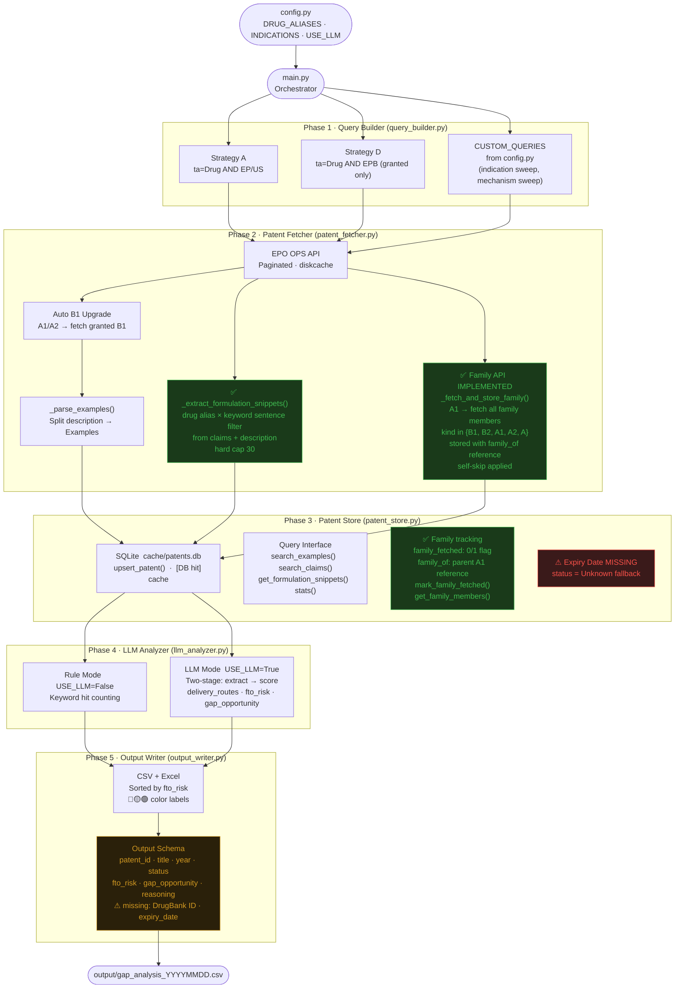

# Prior Art Tool — System Architecture

> Drug Repurposing Patent Analyzer · Current State  
> Last updated: 2026-05 (Bug X: family expansion kind filter widening + self-skip)

---

## Overview

Five-phase pipeline: config → query → fetch → store → analyze → output.  
Each phase has a distinct responsibility and a clear handoff to the next.

---

## End-to-End Data Flow



---

## Module Responsibilities

| Module | Path | Responsibility |
|--------|------|----------------|
| Config | `config.py` | All parameters in one place — only file to touch when switching projects |
| Query Builder | `modules/query_builder.py` | Generate EPO CQL search strings (Strategy A, D, + CUSTOM_QUERIES) |
| Patent Fetcher | `modules/patent_fetcher.py` | Call EPO OPS API, paginate, parse examples, extract formulation snippets, auto-upgrade A1→B1, expand family (cross-jurisdiction A-series included) |
| Patent Store | `modules/patent_store.py` | SQLite local cache; family tracking; formulation snippet storage; cross-project persistent store |
| LLM Analyzer | `modules/llm_analyzer.py` | Rule-based or two-stage LLM FTO scoring |
| Output Writer | `modules/output_writer.py` | Sort, filter, write CSV + color-coded Excel |
| Inspect Tool | `tools/inspect_patent.py` | On-demand patent inspection: read DB + re-run snippet extraction with custom aliases/keywords, EPO fallback on miss (sandbox, no persist) |

---

## Fetch Priority Logic

```
① Check local patents.db  →  [DB hit]
        │
        ├─ If A1/A2 and family_fetched=0  →  call _fetch_and_store_family()
        │       → EPO family API → fetch all family members
        │         (kind in {B1, B2, A1, A2, A}, self-skip applied)
        │       → upsert with family_of = parent A1
        │       → mark_family_fetched(parent)
        │
        ├─ If A1/A2 and family_fetched=1  →  [family DB hit]
        │       → get_family_members() from DB (no API call)
        │
        └─ return patent + _family_members
        ↓ miss
② EPO OPS API  →  title / abstract / claims / description
        ↓
③ _parse_examples()  →  slice Examples section from description
        ↓
③b _extract_formulation_snippets()  →  drug × keyword sentences
        from claims (priority) + description, hard cap 30
        ↓
④ upsert_patent()  →  write to SQLite (incl. formulation_snippets as JSON)
        ↓
⑤ If A1/A2  →  auto-fetch B1 (same number, kind code swap)
        ↓
⑥ If A1/A2  →  _fetch_and_store_family()
              → EPO family API → all family members
                (kind in {B1, B2, A1, A2, A}, self-skip applied)
              → stored with family_of reference
              → mark_family_fetched()
```

---

## EPO OPS Data Coverage

| Patent Type | title/abstract | claims | description/examples | Search indexing |
|-------------|:--------------:|:------:|:--------------------:|:---------------:|
| EP granted (EPB) | ✅ | ✅ | ✅ | ✅ |
| EP application (A1/A2) | ✅ | ❌ | partial | ✅ representative |
| US application (A1) | ✅ | ❌¹ | ❌¹ | ✅ representative |
| US granted (B1/B2) | ✅ | ❌¹ | ❌¹ | ⚠️ not in search, found via family API |
| WO / AU / CN / MX | partial | ❌¹ | ❌¹ | partial |

¹ EPO OPS subscription does not include fulltext (claims/description) for
non-EP jurisdictions. Returns HTTP 404. This is a data licensing limit,
not a code bug. Verified 2026-05 via Task C probe matrix across EP/US/CN
patents × Epodoc/Docdb/Original model classes.

**Key insight from Pemirolast × IPF validation:**
EPO search returns the **representative publication** of a patent family (usually A1).
The granted B2 has a **different patent number** — requires EPO family API to discover.
Family API call: `client.family("publication", Epodoc(number_without_kind), None, ["biblio"])`

---

## Patent Store Schema

```sql
CREATE TABLE patents (
    patent_id            TEXT PRIMARY KEY,
    title                TEXT,
    abstract             TEXT,
    claims               TEXT,
    examples_extracted   TEXT,    -- Examples section (full)
    formulation_snippets TEXT,    -- JSON list: drug × keyword sentences (≤30)
    status               TEXT,
    year                 TEXT,
    source               TEXT,
    fetched_at           TEXT,
    family_fetched       INTEGER DEFAULT 0,
    family_of            TEXT
);
```

Key functions added:
- `mark_family_fetched(patent_id)` — mark A1 as expanded
- `get_family_members(patent_id)` — get all members where `family_of = patent_id`
- `get_formulation_snippets(patent_id)` — return parsed list of formulation sentences

Note: `examples_extracted` and `formulation_snippets` are complementary —
`examples_extracted` keeps the full Examples section for FTO analysis;
`formulation_snippets` keeps targeted drug × keyword sentences for formulation evidence.
Pre-Task-A rows have `formulation_snippets = NULL` pending backfill.

---

## Gap Analysis

### Current Status

| # | Gap | Location | Priority | Status | Notes |
|---|-----|----------|----------|--------|-------|
| 1 | Patent family not expanded | `patent_fetcher.py` | **P1** | ✅ Fixed | family API implemented 2025-05 |
| 2 | Pre-existing family members missing family_of | `patent_fetcher.py` | **P1** | ✅ Fixed | backfill on re-process |
| 3a | backfill_family_of.py for old DB records (family_of=NULL) | new script | **P1** | ⚠️ Pending | 4 known affected patents (Case 1) |
| 3b | backfill_formulation_snippets.py for pre-Task-A rows | new script | **P2** | ⚠️ Pending | NULL on rows fetched before 2026-05 |
| 3c | `_fetch_claims` returns empty for US/CN granted | `patent_fetcher.py` | **N/A** | ✅ Investigated | Not a code bug — EPO data licensing limit (see Known Limitations). EP granted works correctly. Verified 2026-05. |
| 3d | Snippet extraction missed `comprising`/`comprised` | `patent_fetcher.py` | **P1** | ✅ Fixed | Keyword `comprises` → `compris` (substring matches all three verb forms). Task C 2026-05. |
| 3e | Silent except in `_fetch_claims` hid EPO 404 | `patent_fetcher.py` | **P2** | ✅ Fixed | Added warning log; behavior unchanged for callers. Task C 2026-05. |
| 3f | backfill A-series family members (Case 2) | new script | **P1** | ⚠️ Pending | Parents fetched before May 2026 may have missed TW/KR/AU/JP siblings |
| 3g | `_fetch_and_store_family()` filter widened to accept A-series | `patent_fetcher.py` | **P1** | ✅ Fixed | Was `{B1, B2}`, now `{B1, B2, A1, A2, A}`. Self-reference skip also added. May 2026. |
| 4 | Single-drug config only | `config.py` + `main.py` | **P1** | ❌ Open | bio team pipeline blocker |
| 5 | Patent expiry date not calculated | `patent_store.py` | **P1** | ❌ Open | status = Unknown fallback |
| 6 | Rule mode delivery_routes / indications hardcoded | `llm_analyzer.py` | **P2** | ❌ Open | config values not text-extracted |
| 7 | AU / TW / KR / JP coverage incomplete | `query_builder.py` + EPO indexing | **P2** | ⚠️ Partially resolved | Family expansion now recovers cross-jurisdiction siblings (3g). Orphan patents (no EP/US family member found by query) still missed — needs mechanism-based or full-text query strategy (Bug Y). |
| 8 | Output missing `drugbank_id` / `expiry_date` | `output_writer.py` | **P2** | ❌ Open | bio team schema mismatch |
| 9 | Toxicity filtering absent | new module needed | **P2** | ❌ Open | deprioritized by bio team |
| 10 | No REST API endpoint | new `api/` layer | **P3** | ❌ Open | bio team integration |

### Roadmap

```
P1  Next up
    ├── Backfill family expansion (3a + 3f combined)
    │   → for parents fetched before May 2026 filter widening
    │   → reset family_fetched=0, re-trigger family API
    │   → covers both family_of=NULL legacy rows and missed A-series siblings
    ├── Backfill formulation_snippets (3b)
    │   → for pre-Task-A rows with formulation_snippets=NULL
    │   → no API call needed; re-run extraction on existing claims/examples
    ├── Investigate Bug Y (mechanism/structure-described patents) (row 7)
    ├── Accept drug list CSV as input (row 4)
    └── Add expiry_date field + auto-calculation (row 5)

P2  Quality and coverage
    ├── Fix rule mode: extract delivery_routes / indications from text
    ├── Add drugbank_id / expiry_date to output schema
    └── New toxicity_filter module (deprioritized by bio team)

P3  System integration
    └── REST API layer
```

---

## Known Limitations

### EPO Family API — Correct Call Signature

```python
# CORRECT: Epodoc without kind code
resp = client.family(
    "publication",
    epo_ops.models.Epodoc(number),  # no kind code
    None,
    ["biblio"]
)

# WRONG: causes URL duplication bug in epo_ops library
resp = client.family(
    reference_type="publication",
    input=epo_ops.models.Epodoc(number, kind),  # kind code causes bug
    endpoint="biblio",
)
```

**Reproduced by:** `tests/test_family_api.py`

### EPO Fulltext Coverage by Jurisdiction

EPO OPS subscription provides fulltext (claims/description endpoints) only
for EP-issued patents (EPB). US, CN, JP, WO, etc. fulltext returns HTTP
404 by EPO design — this is a data licensing limitation, not a code
defect.

Practical implications:
- US/CN/WO patents in our DB have empty `claims` and `examples_extracted`
- Snippet extraction for these patents relies entirely on abstract
  (abstract endpoint IS available for all jurisdictions)
- Family expansion of EP-A1 to EP-B1 is the primary path to obtain
  granted-patent fulltext for analysis
- The `_fetch_claims` function logs a warning on 404 but returns empty
  string (caller-compatible behavior)

Investigation (Task C, 2026-05) confirmed via probe matrix that no
combination of Epodoc / Docdb / Original model classes unlocks non-EP
fulltext — the restriction is at EPO's data layer, not in our client.

Future option: integrate a separate fulltext source (e.g. Google Patents
Public Datasets) for US/CN coverage. Out of scope for current iteration.

---

### Incomplete Family Coverage

Two historical states cause family members to be incomplete in the local DB.
Both can be resolved by re-processing the parent (which will re-trigger
family API call), but **a backfill script for existing DB rows is pending**.

#### Case 1: `family_of = NULL`

Patents stored before the `family_of` field was introduced have
`family_of = NULL` and are invisible to `get_family_members()`.

Re-processing the parent A1 will automatically backfill `family_of` for
these members.

**Known affected (4 patents):**
- `EP2443120B1` — Crystalline form of Pemirolast
- `EP2107907B1` — Pemirolast + ramatroban combination
- `EP1285921B1` — Pemirolast preparation process
- `NO20210693B1` — Capsaicin × IPF

#### Case 2: Missing A-series family members

For parents fetched before May 2026, `_fetch_and_store_family()` skipped
any family member whose kind code was not `B1` or `B2`. This silently
omitted cross-jurisdiction application versions (e.g. TW, KR, AU, JP
filings that publish as `A` rather than `B1/B2`).

The filter was widened in May 2026 to accept `{B1, B2, A1, A2, A}`,
but existing DB rows with `family_fetched = 1` are **not** automatically
re-expanded — they take the `[DB hit]` path on re-run.

**Known recovered (after May 2026 fix):**
- `WO2023073600A1` — TW202328118A + KR20230062785A added on re-process

**Likely still missing** (any parent with `family_fetched = 1` set
before May 2026 may have lost cross-jurisdiction A-series siblings).
Backfill script is the proper resolution.

#### Backfill (pending)

A backfill script is needed to reset `family_fetched = 0` on parents
fetched before the May 2026 fix and trigger a full re-expansion. Open
items:

- Decide scope: only Pemirolast/Acetaminophen/Roflumilast projects, or
  all parents in DB?
- Estimate EPO API impact (each parent = 1 family API call + N member
  fetches)
- Define "fetched before May 2026" detection (use `fetched_at` column
  comparison, or just `family_fetched = 1 AND family_of IS NULL` as
  proxy?)

Tracked as Gap Analysis item.

---

## Validation Log

| Date | Drug × Indication | Config | Patents found | FTO result | Notes |
|------|-------------------|--------|---------------|------------|-------|
| 2025-04 | Roflumilast × SCA | `configs/roflumilast_sca.py` | — | baseline | original project |
| 2025-04 | Pemirolast × IPF | `configs/pemirolast_ipf.py` | 249 | 0 High / 22 Medium | P0 ✅; B2 gap found |
| 2025-05 | Pemirolast × IPF | `configs/pemirolast_ipf.py` | 293 | — | family API implemented; +44 patents vs prev run |
| 2026-05 | Acetaminophen × formulation evidence | `configs/acetaminophen_formulation_evidence.py` | — | Task A + C verified | snippet extraction added (Task A); Task C investigation reclassified `_fetch_claims` 404 as EPO licensing limit (non-EP) and fixed keyword stem bug; EP2089013B1 verified end-to-end |
| 2026-05 | Pemirolast × IPF (re-audit) | `configs/pemirolast_ipf.py` | — | Bug X verified | family expansion filter widened (B1/B2 → {B1,B2,A1,A2,A}); self-reference skip added; WO2023073600A1 family now correctly recovers TW202328118A + KR20230062785A; backfill of pre-May-2026 parents pending |

---

## Test Scripts

| Script | Purpose |
|--------|---------|
| `tests/test_epo_search_vs_fetch.py` | Reproduces B2 missing from search results |
| `tests/test_family_api.py` | Validates EPO family API call signature and response parsing |
| `tests/test_formulation_snippets.py` | Regression tests for `_extract_formulation_snippets` — drug × keyword filter, alias matching, cap, JSON-serializability |

---

## Notes

- This tool is a **radar, not legal advice**. High/Medium risk patents still require claim construction by a patent attorney.
- EPO OPS weekly quota: **3.5 GB**. `cache/epo/` (diskcache) prevents redundant API calls.
- Re-running `main.py` is safe — patents already in `patents.db` take the `[DB hit]` path.
- Claims text truncated at `CLAIMS_MAX_CHARS` (default 3000) — adjust in `config.py`.
- `configs/` directory contains per-project config snapshots. `config.py` is always the active config.

---

## Developer Tools

### `tools/inspect_patent.py`

Ad-hoc patent inspection independent of the production pipeline.

- Reads any patent from `cache/patents.db`
- Re-runs `_extract_formulation_snippets` with user-supplied aliases/keywords
- On DB miss: fetches from EPO without persisting (sandbox mode)
- Read-only with respect to the main DB

Useful for:
- Quick "does this patent mention X?" queries
- Testing new keyword/alias variants before committing config changes
- Cross-project exploration (find Y in patents from a different project)
- Debugging Task A extraction quality on individual patents

See module docstring for usage examples.