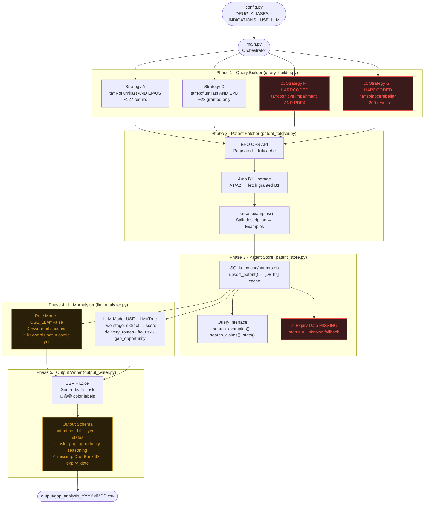

# Prior Art Tool — System Architecture

> Drug Repurposing Patent Analyzer · Current State  
> Last updated: 2025-04

---

## Overview

Five-phase pipeline: config → query → fetch → store → analyze → output.  
Each phase has a distinct responsibility and a clear handoff to the next.

---

## End-to-End Data Flow



---

## Module Responsibilities

| Module | Path | Responsibility |
|--------|------|----------------|
| Config | `config.py` | All parameters in one place — only file to touch when switching projects |
| Query Builder | `modules/query_builder.py` | Generate EPO CQL search strings (4 strategies) |
| Patent Fetcher | `modules/patent_fetcher.py` | Call EPO OPS API, paginate, parse examples, auto-upgrade A1→B1 |
| Patent Store | `modules/patent_store.py` | SQLite local cache; cross-project persistent store |
| LLM Analyzer | `modules/llm_analyzer.py` | Rule-based or two-stage LLM FTO scoring |
| Output Writer | `modules/output_writer.py` | Sort, filter, write CSV + color-coded Excel |

---

## Fetch Priority Logic

Every patent follows this lookup order before hitting the API:

```
① Check local patents.db  →  [DB hit] return immediately
        ↓ miss
② EPO OPS API  →  title / abstract / claims / description
        ↓
③ _parse_examples()  →  slice Examples section from description
        ↓
④ upsert_patent()  →  write to SQLite
        ↓
⑤ If A1/A2  →  auto-fetch corresponding B1 (complete claims)
```

---

## Scoring Reference

### Rule Mode (`USE_LLM = False`)

Keyword categories matched against title + abstract + claims:

| Category | Keywords (currently in `llm_analyzer.py`) | Weight |
|----------|------------------------------------------|--------|
| Drug | `roflumilast`, `pde4`, `phosphodiesterase 4` | High |
| Route | `nasal`, `intranasal`, `nose-to-brain` | High |
| Indication | `spinocerebellar`, `ataxia`, `cerebellar` | High |
| CNS | `neurodegenerat`, `cerebellum`, `purkinje` | Medium |

> ⚠ These keywords are **not yet in `config.py`** — pending refactor.

### LLM Mode (`USE_LLM = True`)

Two-stage pipeline per patent:

1. **Extract** — structured fields: `delivery_routes`, `indications`, `formulation_type`
2. **Score** — `fto_risk` (High / Medium / Low) + `gap_opportunity` + `reasoning`

---

## Output Schema

| Field | Description |
|-------|-------------|
| `patent_id` | Unique patent identifier |
| `title` | Patent title |
| `year` | Publication year |
| `status` | Active / Expired / Unknown |
| `is_target_drug` | Mentions Roflumilast or PDE4i |
| `delivery_routes` | List of administration routes |
| `indications` | List of therapeutic indications |
| `fto_risk` | **High / Medium / Low** — primary sort key |
| `gap_opportunity` | Claim space not covered by this patent |
| `reasoning` | Scoring rationale |

> ⚠ Missing fields for downstream integration: `drugbank_id`, `expiry_date`

---

## EPO OPS Data Coverage

| Patent Type | title/abstract | claims | description/examples |
|-------------|:--------------:|:------:|:--------------------:|
| EP granted (EPB) | ✅ | ✅ | ✅ |
| EP application (A1/A2) | ✅ | ❌ | partial |
| US application (A1) | ✅ | ❌ | ❌ |
| US granted (B1/B2) | ✅ | partial | partial |
| WO / AU / CN / MX | partial | ❌ | ❌ |

EPB is the richest source — fetcher auto-upgrades A1/A2 to B1 where available.

---

## Gap Analysis

### Current Status

| # | Gap | Location | Priority | Impact |
|---|-----|----------|----------|--------|
| 1 | Strategy F/G keywords hardcoded | `query_builder.py` | **P0** | Wrong queries when switching disease |
| 2 | Rule keywords not in `config.py` | `llm_analyzer.py` | **P0** | FTO scoring ignores new drug/indication |
| 3 | Single-drug config only | `config.py` + `main.py` | **P1** | Cannot batch-process drug candidate lists |
| 4 | Patent expiry date not calculated | `patent_store.py` | **P1** | Cannot filter out expired patents |
| 5 | Output missing `drugbank_id` / `expiry_date` | `output_writer.py` | **P2** | Hard to join with bio team schema |
| 6 | Toxicity filtering absent | new module needed | **P2** | Filter step incomplete vs. SOP requirement |
| 7 | No REST API endpoint | new `api/` layer | **P3** | Bio team cannot call programmatically |

### Roadmap

```
P0  Fix config completeness
    ├── Move Strategy F/G keywords into config.py
    └── Move RULE_*_KEYWORDS from llm_analyzer.py into config.py

P1  Enable multi-drug input
    ├── Accept drug list CSV as input (replace single config entry)
    └── Add expiry_date field + auto-calculation in patent_store.py

P2  Extend filter coverage
    ├── Add drugbank_id / expiry_date to output schema
    └── New toxicity_filter module (FDA FAERS or DrugBank)

P3  System integration
    └── REST API layer so bio team pipeline can call programmatically
```

---

## Notes

- This tool is a **radar, not legal advice**. High/Medium risk patents still require claim construction by a patent attorney.
- EPO OPS weekly quota: **3.5 GB**. `cache/epo/` (diskcache) prevents redundant API calls.
- Re-running `main.py` is safe — patents already in `patents.db` take the `[DB hit]` path.
- Claims text truncated at `CLAIMS_MAX_CHARS` (default 3000) — adjust in `config.py`.
