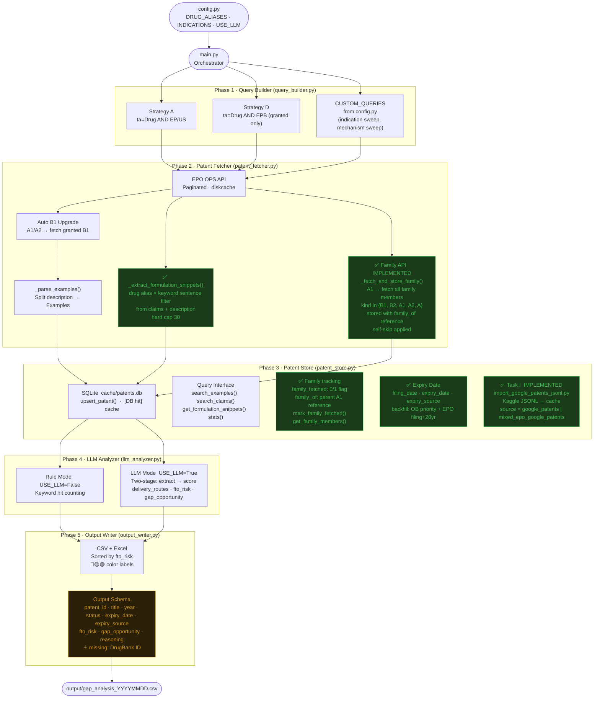

# Prior Art Tool — System Architecture

> Drug Repurposing Patent Analyzer · Current State
> Last updated: 2026-07-16 (tools: batch_epo_probe, compare_coverage; validation: GPP+IPF source coverage analysis)

---

## Overview

Five-phase pipeline: config → query → fetch → store → analyze → output.  
Each phase has a distinct responsibility and a clear handoff to the next.

> 📄 **Design rationale:** See [`./spec/design_formulation_evidence.md`](./spec/design_formulation_evidence.md)
> for the strategic context behind the formulation evidence subsystem
> (snippet extraction, two-layer analysis, why not store full description).
> 
> 📄 **Active task specs:** See [`./spec/task_A.md`](./spec/task_A.md) through [`./spec/task_J5.md`](./spec/task_J5.md)
> for individual feature/fix specs. Task H is superseded by Task I (see note in task_H file).

---

## End-to-End Data Flow



---

## Module Responsibilities

| Module | Path | Responsibility |
|--------|------|----------------|
| Config | `config.py` | All parameters in one place — only file to touch when switching projects |
| Query Builder | `modules/query_builder.py` | Generate EPO CQL search strings (Strategy A, D, + CUSTOM_QUERIES) |
| Patent Fetcher | `modules/patent_fetcher.py` | Call EPO OPS API, paginate, parse examples, extract formulation snippets, auto-upgrade A1→B1, expand family (cross-jurisdiction A-series included) |
| Patent Store | `modules/patent_store.py` | SQLite local cache; family tracking; formulation snippet storage; cross-project persistent store |
| LLM Analyzer | `modules/llm_analyzer.py` | Rule-based or two-stage LLM FTO scoring; Supports reasoning models (GPT-5, o3) via _make_llm() — auto-detects temperature support and token budget. |
| Output Writer | `modules/output_writer.py` | Sort, filter, write CSV + color-coded Excel |
| Inspect Tool | `tools/inspect_patent.py` | On-demand patent inspection: read DB + re-run snippet extraction with custom aliases/keywords, EPO fallback on miss (sandbox, no persist) |
| Importer | `scripts/import_google_patents_jsonl.py` | One-off import of Google Patents fulltext from a JSONL artifact (scraped off-machine on Kaggle). Targets non-EP/WO rows in the artifact whose claims are currently empty. Only those rows are touched; EP/WO and EPO-populated rows are not overwritten. See Task I. |
| API Layer | `api/` | REST API (FastAPI + Docker). J-0: health check. J-1: DB lookup + stats. J-2: inspect (DB hit + EPO sandbox fallback). J-3: single-patent LLM scoring (dry-run + live). J-4: A/B rubric comparison. All logic ported inline — does not import `modules/` (D1). See `design_api_layer.md`. |

---

## Fetch Priority Logic

```
① Check local patents.db  →  [DB hit]
        │
        ├─ If A1/A2 and family_fetched=0  →  call _fetch_and_store_family()
        │       → EPO family API → fetch all family members
        │         (kind in {B1, B2, A1, A2, A}, self-skip applied)
        │       → upsert with family_of = parent A1
        │       → piggyback: filing_date + expiry_date + year from
        │         application-reference / publication-reference (0 extra API calls)
        │       → parent row updated from self-reference in family response
        │       → mark_family_fetched(parent)
        │
        ├─ If A1/A2 and family_fetched=1  →  [family DB hit]
        │       → get_family_members() from DB (no API call)
        │
        └─ return patent + _family_members
        ↓ miss
② EPO OPS API  →  title / abstract / claims / description
        ↓
③ _parse_examples()  →  slice Examples section from description
        ↓
③b _extract_formulation_snippets()  →  drug × keyword sentences
        from claims (priority) + description, hard cap 30
        ↓
④ upsert_patent()  →  write to SQLite (incl. formulation_snippets as JSON)
        ↓
⑤ If A1/A2  →  auto-fetch B1 (same number, kind code swap)
        ↓
⑥ If A1/A2  →  _fetch_and_store_family()
              → EPO family API → all family members
                (kind in {B1, B2, A1, A2, A}, self-skip applied)
              → stored with family_of reference
              → piggyback: filing_date + expiry_date + year (0 extra API calls)
              → parent row updated from self-reference
              → mark_family_fetched()
```

---

## EPO OPS Data Coverage

| Patent Type | biblio (title/abstract) | claims | description/examples | Search indexing |
|-------------|:-----------------------:|:------:|:--------------------:|:---------------:|
| EP granted (EPB) | ✅ | ✅ | ✅ | ✅ |
| EP application (A1/A2) | ✅ | ✅³ | ✅³ | ✅ representative |
| WO | ✅ | ✅³ | ✅³ | partial |
| US application (A1) | ❌⁴ | ❌¹ | ❌¹ | ✅ representative |
| US granted (B1/B2) | ❌⁴ | ❌¹ | ❌¹ | ⚠️ not in search, found via family API |
| CN-A (application) | ✅ | ❌¹ | ❌¹ | partial |
| CN-B (granted) | ❌⁴ | ❌¹ | ❌¹ | partial |
| AU / MX / other | partial | ❌¹/✅² | ❌¹/✅² | partial |

¹ EPO OPS subscription does not include fulltext (claims/description) for
non-EP jurisdictions. Returns HTTP 404. This is a data licensing limit,
not a code bug. Verified 2026-05 via Task C probe matrix across EP/US/CN
patents × Epodoc/Docdb/Original model classes.

² Google Patents JSONL supplement (Task I, 2026-06) provides claims/
examples for rows in the Kaggle scrape batch. Coverage is per-batch,
not automatic.

³ EP-A1 and WO returned fulltext via direct Epodoc lookup in probe
(2026-06-15). This may vary by individual patent.

⁴ Direct Epodoc lookup returns HTTP 404 even on biblio endpoint.
Probe 2026-06-15: US 8/8 patents returned 404 on biblio; CN-B also 404.
**Production path is unaffected:** search results carry biblio metadata
inline, so patents discovered via search or family API still have
title/abstract in DB. This only affects `inspect_patent` sandbox
fallback (ad-hoc lookup of patents not in DB). Sandbox fallback now
detects this and shows Espacenet/Google Patents URLs.

**Key insight from Pemirolast × IPF validation:**
EPO search returns the **representative publication** of a patent family (usually A1).
The granted B2 has a **different patent number** — requires EPO family API to discover.
Family API call: `client.family("publication", Epodoc(number_without_kind), None, ["biblio"])`

---

## Patent Store Schema

```sql
CREATE TABLE patents (
    patent_id            TEXT PRIMARY KEY,
    title                TEXT,
    abstract             TEXT,
    claims               TEXT,
    examples_extracted   TEXT,    -- Examples section (full)
    formulation_snippets TEXT,    -- JSON list: drug × keyword sentences (≤30)
    status               TEXT,
    year                 TEXT,
    source               TEXT,   -- 'epo' / 'google_patents' / 'mixed_epo_google_patents' (Task I)
    fetched_at           TEXT,
    family_fetched       INTEGER DEFAULT 0,
    family_of            TEXT
    filing_date          TEXT,   -- YYYY-MM-DD, from EPO biblio or OB
    expiry_date          TEXT,   -- YYYY-MM-DD, OB exact or filing+20yr
    expiry_source        TEXT    -- 'orange_book' | 'filing_plus_20' | 'manual'
);
```

Key functions added:
- `mark_family_fetched(patent_id)` — mark A1 as expanded
- `get_family_members(patent_id)` — get all members where `family_of = patent_id`
- `get_formulation_snippets(patent_id)` — return parsed list of formulation sentences

Note: `examples_extracted` and `formulation_snippets` are complementary —
`examples_extracted` keeps the full Examples section for FTO analysis;
`formulation_snippets` keeps targeted drug × keyword sentences for formulation evidence.
Pre-Task-A rows have `formulation_snippets = NULL` pending backfill.

Expiry date populated via two paths:
1. `scripts/backfill_expiry_dates.py` (two-layer: Orange Book priority
   for US NDA patents, EPO filing+20yr fallback for all jurisdictions).
   ~97% coverage; utility models and translation patents typically
   return 404 from EPO biblio.
2. Fetch-time piggyback (Phase 3, 2026-06): `_fetch_and_store_family()`
   parses filing_date + expiry from family response at fetch time.
   Zero extra API calls. New patents get dates automatically.

Output `year` column: populated from publication-reference in family
response for new patents; for old patents with empty year,
`output_writer.py` falls back to `filing_date[:4]` at display time
(DB not modified).

---

## Gap Analysis

### Current Status

| # | Gap | Location | Priority | Status | Notes |
|---|-----|----------|----------|--------|-------|
| 1 | Patent family not expanded | `patent_fetcher.py` | **P1** | ✅ Fixed | family API implemented 2025-05 |
| 2 | Pre-existing family members missing family_of | `patent_fetcher.py` | **P1** | ✅ Fixed | backfill on re-process |
| 3a | backfill_family_of.py for old DB records (family_of=NULL) | new script | **P1** | ⚠️ Pending | 4 known affected patents (Case 1) |
| 3b | backfill_formulation_snippets.py for pre-Task-A rows | new script | **P2** | ⚠️ Pending | NULL on rows fetched before 2026-05 |
| 3c | `_fetch_claims` returns empty for US/CN granted | `patent_fetcher.py` | **N/A** | ✅ Investigated | Not a code bug — EPO data licensing limit (see Known Limitations). EP granted works correctly. Verified 2026-05. |
| 3d | Snippet extraction missed `comprising`/`comprised` | `patent_fetcher.py` | **P1** | ✅ Fixed | Keyword `comprises` → `compris` (substring matches all three verb forms). Task C 2026-05. |
| 3e | Silent except in `_fetch_claims` hid EPO 404 | `patent_fetcher.py` | **P2** | ✅ Fixed | Added warning log; behavior unchanged for callers. Task C 2026-05. |
| 3f | backfill A-series family members (Case 2) | new script | **P1** | ⚠️ Pending | Parents fetched before May 2026 may have missed TW/KR/AU/JP siblings |
| 3g | `_fetch_and_store_family()` filter widened to accept A-series | `patent_fetcher.py` | **P1** | ✅ Fixed | Was `{B1, B2}`, now `{B1, B2, A1, A2, A}`. Self-reference skip also added. May 2026. |
| 4 | Single-drug config only | `config.py` + `main.py` | **P1** | ❌ Open | bio team pipeline blocker |
| 5 | Patent expiry date not calculated | `patent_store.py` | **P1** | ✅ Done | Phase 1-2: schema + backfill (OB + EPO filing+20yr). Phase 3: fetch-time piggyback from family response (0 extra API calls). Year bug fixed. 2026-06. |
| 6 | Rule mode delivery_routes / indications hardcoded | `llm_analyzer.py` | **P2** | ❌ Open | config values not text-extracted |
| 7 | AU / TW / KR / JP coverage incomplete | `query_builder.py` + EPO indexing | **P2** | ⚠️ Partially resolved | Family expansion (3g) + Google Patents JSONL supplement (Task I) + expert manual review with --allow-insert (Task L) now cover most cases. Remaining gap: patents discoverable only via fulltext search (content in claims/description, not title/abstract) — L3b pending validation. 2026-07-16: GP vs EPO coverage validated on 584 expert patents — see `docs/validation/coverage_analysis_gpp_ipf_20260716.md`. |
| 8 | Output missing `drugbank_id` / `expiry_date` | `output_writer.py` | **P2** | ⚠️ Partial | expiry_date + expiry_source added 2026-06. drugbank_id still missing. |
| 9 | Toxicity filtering absent | new module needed | **P2** | ❌ Open | deprioritized by bio team |
| 10 | REST API endpoint | `api/` layer | **P2** | ✅ Done | J-0 through J-5 shipped 2026-06-25. 6 endpoints (health, DB lookup, stats, inspect, score, compare). 46-check smoke test. Deployment guide at `docs/api_deployment.md`. |
| 11 | Reasoning model token budget may need tuning | `llm_analyzer.py` | **P3** | ⚠️ Partial | GPT-5 screening=4000, analysis=8000; some patents still fail if reasoning chain is long |

### Roadmap

```
P1  Next up
    ├── Backfill family expansion (3a + 3f combined)
    │   → for parents fetched before May 2026 filter widening
    │   → reset family_fetched=0, re-trigger family API
    │   → covers both family_of=NULL legacy rows and missed A-series siblings
    ├── Backfill formulation_snippets (3b)
    │   → for pre-Task-A rows with formulation_snippets=NULL
    │   → no API call needed; re-run extraction on existing claims/examples
    ├── Investigate Bug Y (mechanism/structure-described patents) (row 7)
    ├── Accept drug list CSV as input (row 4)
    └── Add drugbank_id to output (row 8, remaining half)

P2  Quality and coverage
    ├── Fix rule mode: extract delivery_routes / indications from text
    ├── Add drugbank_id to output schema (row 8, remaining half)
    └── New toxicity_filter module (deprioritized by bio team)

P3  System integration
    ├── REST API layer
    │   ✅ J-0 scaffolding (health check, Docker, deps)
    │   ✅ J-1 DB endpoints (patent lookup, stats)
    │   ✅ J-2 inspect endpoint (DB hit + EPO sandbox fallback)
    │   ✅ J-3 scoring endpoint (dry-run + live LLM)
    │   ✅ J-4 compare endpoint (A/B rubric test)
    │   └── ✅ J-5 deployment guide + smoke test
    └── smoke test: tests/test_api_smoke.py (46 checks, J-0 through J-4)
```

---

## Known Limitations

### EPO Family API — Correct Call Signature

```python
# CORRECT: Epodoc without kind code
resp = client.family(
    "publication",
    epo_ops.models.Epodoc(number),  # no kind code
    None,
    ["biblio"]
)

# WRONG: causes URL duplication bug in epo_ops library
resp = client.family(
    reference_type="publication",
    input=epo_ops.models.Epodoc(number, kind),  # kind code causes bug
    endpoint="biblio",
)
```

**Reproduced by:** `tests/test_family_api.py`

### EPO Fulltext Coverage by Jurisdiction

EPO OPS subscription provides fulltext (claims/description endpoints) only
for EP-issued patents (EPB). US, CN, JP, WO, etc. fulltext returns HTTP
404 by EPO design — this is a data licensing limitation, not a code
defect.

Practical implications:
- US/CN/WO patents in our DB have empty `claims` and `examples_extracted`
- Snippet extraction for these patents relies entirely on abstract
- Biblio (title/abstract) is available for EP, WO, and CN-A via direct
  Epodoc lookup, but **not** for US or CN-B (404 on biblio endpoint).
  Production path is unaffected because search results carry biblio
  inline; this only affects `inspect_patent` sandbox fallback.
- Family expansion of EP-A1 to EP-B1 is the primary path to obtain
  granted-patent fulltext for analysis
- The `_fetch_claims` function logs a warning on 404 but returns empty
  string (caller-compatible behavior)

Investigation (Task C, 2026-05) confirmed via probe matrix that no
combination of Epodoc / Docdb / Original model classes unlocks non-EP
fulltext — the restriction is at EPO's data layer, not in our client.

Future option: integrate a separate fulltext source (e.g. Google Patents
Public Datasets) for US/CN coverage. Out of scope for current iteration.

**Supplement path (implemented 2026-06, Task I):**

For non-EP fulltext, an off-machine scraper (Kaggle notebook) produces a
JSONL artifact; `scripts/import_google_patents_jsonl.py` writes that
content back into the cache. **The scope is whichever rows are in the
JSONL — not all non-EP rows in the DB.** Affected rows are tagged with
`source = 'google_patents'` (or `mixed_epo_google_patents` for hybrid
rows where claims came from Google but examples remained from EPO).

Coverage as of 2026-06 (Pemirolast project, 369 rows total): 168 rows
imported from Google Patents, 151 already had EPO content, 50 remain
empty (Google had no content either, or are EP/WO rows EPO didn't
capture).

### EPO ta= Query Scope — Title + Abstract Only

EPO OPS `ta=` 搜尋只索引 title 和 abstract，不含 claims 或
description。即使專利在 EPO 系統中有完整 fulltext，只要關鍵內容
不在 title/abstract 裡，`ta=` query 就搜不到。

This is distinct from the fulltext licensing gap above: even for
jurisdictions where EPO has full content, the search index only covers
title + abstract fields.

Case: US9415051B1 — abstract mentions "airway hyperresponsiveness",
but claim 5 explicitly names Pemirolast for treating IPF.
`ta=pemirolast` finds it, but `ta=pemirolast AND ta=IPF` does not.

Workaround (Task L, 2026-07): expert manual review → off-machine
scrape or EPO fetch → `--allow-insert` import → `search_log` entry
with `query='will_manual_review'`. Scalable alternative (Google Patents
fulltext search, L3b) pending validation.

---

### Incomplete Family Coverage

Two historical states cause family members to be incomplete in the local DB.
Both can be resolved by re-processing the parent (which will re-trigger
family API call), but **a backfill script for existing DB rows is pending**.

#### Case 1: `family_of = NULL`

Patents stored before the `family_of` field was introduced have
`family_of = NULL` and are invisible to `get_family_members()`.

Re-processing the parent A1 will automatically backfill `family_of` for
these members.

**Known affected (4 patents):**
- `EP2443120B1` — Crystalline form of Pemirolast
- `EP2107907B1` — Pemirolast + ramatroban combination
- `EP1285921B1` — Pemirolast preparation process
- `NO20210693B1` — Capsaicin × IPF

#### Case 2: Missing A-series family members

For parents fetched before May 2026, `_fetch_and_store_family()` skipped
any family member whose kind code was not `B1` or `B2`. This silently
omitted cross-jurisdiction application versions (e.g. TW, KR, AU, JP
filings that publish as `A` rather than `B1/B2`).

The filter was widened in May 2026 to accept `{B1, B2, A1, A2, A}`,
but existing DB rows with `family_fetched = 1` are **not** automatically
re-expanded — they take the `[DB hit]` path on re-run.

**Known recovered (after May 2026 fix):**
- `WO2023073600A1` — TW202328118A + KR20230062785A added on re-process

**Likely still missing** (any parent with `family_fetched = 1` set
before May 2026 may have lost cross-jurisdiction A-series siblings).
Backfill script is the proper resolution.

#### Backfill (pending)

A backfill script is needed to reset `family_fetched = 0` on parents
fetched before the May 2026 fix and trigger a full re-expansion. Open
items:

- Decide scope: only Pemirolast/Acetaminophen/Roflumilast projects, or
  all parents in DB?
- Estimate EPO API impact (each parent = 1 family API call + N member
  fetches)
- Define "fetched before May 2026" detection (use `fetched_at` column
  comparison, or just `family_fetched = 1 AND family_of IS NULL` as
  proxy?)

Tracked as Gap Analysis item.

---

## Validation Log

| Date | Drug × Indication | Config | Patents found | FTO result | Notes |
|------|-------------------|--------|---------------|------------|-------|
| 2025-04 | Roflumilast × SCA | `configs/roflumilast_sca.py` | — | baseline | original project |
| 2025-04 | Pemirolast × IPF | `configs/pemirolast_ipf.py` | 249 | 0 High / 22 Medium | P0 ✅; B2 gap found |
| 2025-05 | Pemirolast × IPF | `configs/pemirolast_ipf.py` | 293 | — | family API implemented; +44 patents vs prev run |
| 2026-05 | Acetaminophen × formulation evidence | `configs/acetaminophen_formulation_evidence.py` | — | Task A + C verified | snippet extraction added (Task A); Task C investigation reclassified `_fetch_claims` 404 as EPO licensing limit (non-EP) and fixed keyword stem bug; EP2089013B1 verified end-to-end |
| 2026-05 | Pemirolast × IPF (re-audit) | `configs/pemirolast_ipf.py` | — | Bug X verified | family expansion filter widened (B1/B2 → {B1,B2,A1,A2,A}); self-reference skip added; WO2023073600A1 family now correctly recovers TW202328118A + KR20230062785A; backfill of pre-May-2026 parents pending |
| 2026-05 | Ampicillin × formulation evidence | `configs/ampicillin_formulation_evidence.py` | 188 | Task E verified | Excipient pipeline eval V0; top 10 recommendations match manual test table; P@5=0.40 P@10=0.20 (abstract-only ground truth, biased low by design) |
| 2026-05 | Ampicillin × formulation evidence (V1) | `configs/ampicillin_formulation_evidence.py` | 187 | Task F verified | Excipient pipeline eval V1 (CSV-driven); P@5=0.40 P@10=0.20 numerically equal to V0 but hits different keywords (V0: polymethacrylate+MCC, V1: MCC+PEG). Coincidence, not equivalence. Three compounding causes documented in task_F.md post-impl note. Pipeline mechanics validated. |
| 2026-06 | Pemirolast × IPF (Google Patents supplement) | `configs/pemirolast_ipf.py` | 369 | Task I verified | 408 of ~3954 non-EP/WO rows in DB received supplemental fulltext (the rest were not in the scrape scope or had no Google content); Pemirolast project claims coverage delta: CN 0→108, US 0→20, JP 0→16, KR 0→8. 168/168 rows re-extracted by backfill_snippets (26 yielded non-empty formulation snippets). |
| 2026-06 | US9415051B1 risk underscoring investigation | `configs/pemirolast_ipf_v3.py` | 1 (single-patent deep dive) | 58/58 test checks PASS | Root cause: three-layer problem (diskcache bypass, screening abstract-only, rubric dependent-claim downweight). debug_scoring tool confirms: default rubric → Low, rubric_v2 → High. `configs/rubrics/rubric_v2.txt` committed as amended rubric candidate (pending expert review). |

---

## Test Scripts

| Script | Purpose |
|--------|---------|
| `tests/test_epo_search_vs_fetch.py` | Reproduces B2 missing from search results |
| `tests/test_family_api.py` | Validates EPO family API call signature and response parsing |
| `tests/test_formulation_snippets.py` | Regression tests for `_extract_formulation_snippets` — drug × keyword filter, alias matching, cap, JSON-serializability |
| `tests/test_debug_tools.py` | Validation suite for `check_db` + `debug_scoring`. 43 dry-run checks (zero cost) + 15 live LLM checks (`--live` flag). Covers CLI flags, DB lookup, error handling, and spec validation cases (US9415051B1 × pemirolast_ipf_v3). Run with `python -m tests.test_debug_tools [--live]`. |
| `tools/eval_v0.py` | Excipient pipeline evaluation V0 — reads patent DB, extracts keyword-based ground truth, calls recommend API, computes P@k. Run with `python -m tools.eval_v0`. |
| `tools/eval_v1.py` | Excipient pipeline evaluation V1 (CSV-driven) — same pipeline as V0 but reads patent list from `--csv`, derives keyword list dynamically from recommend API top 10, adds typo guard. Run with `python -m tools.eval_v1 --csv ... --drug ... --target-excipient ...`. |
| `tests/test_api_smoke.py` | HTTP smoke test for API layer (J-0 through J-4). 46 checks covering health, DB lookup/stats, inspect DB hit/miss/EPO fallback, custom keywords, source_filter, validation, score dry-run/stage/errors, compare errors. Zero-dependency (urllib only), runs against live server. `python tests/test_api_smoke.py [--base-url URL]`. |

---

## Notes

- This tool is a **radar, not legal advice**. High/Medium risk patents still require claim construction by a patent attorney.
- EPO OPS weekly quota: **3.5 GB**. `cache/epo/` (diskcache) prevents redundant API calls.
- Re-running `main.py` is safe — patents already in `patents.db` take the `[DB hit]` path.
- Claims text truncated at `CLAIMS_MAX_CHARS` (default 3000) — adjust in `config.py`.
- `configs/` directory contains per-project config snapshots. `config.py` is always the active config.
- `configs/rubrics/` directory contains rubric override files for A/B testing
  ANALYSIS_SYSTEM prompts. Files use `{TARGET_DRUG}`, `{TARGET_ROUTE}`,
  `{TARGET_INDICATION}` placeholders, interpolated at runtime from the
  specified `--config`.
- `outputs/ground_truth/*.json` are evaluation artifacts — keep the first committed baseline, but do not re-commit every re-run (only metadata like timestamp / git_commit changes).
- For non-EP fulltext (US/CN/KR/JP/EA), Google Patents supplement is
  available via `scripts/import_google_patents_jsonl.py`. The scraper
  runs off-machine on Kaggle; JSONL artifact is gitignored. See
  [Task I](spec/task_I_google_patents_jsonl_import.md).

---

## Developer Tools

### `tools/inspect_patent.py`

Ad-hoc patent inspection independent of the production pipeline.

- Reads any patent from `cache/patents.db`
- Re-runs `_extract_formulation_snippets` with user-supplied aliases/keywords
- On DB miss: fetches from EPO without persisting (sandbox mode)
- Read-only with respect to the main DB

Useful for:
- Quick "does this patent mention X?" queries
- Testing new keyword/alias variants before committing config changes
- Cross-project exploration (find Y in patents from a different project)
- Debugging Task A extraction quality on individual patents

See module docstring for usage examples.

### `tools/eval_v0.py`

Baseline evaluation script for the excipient recommendation pipeline.

- Hardcoded input: 6 patents × Ampicillin × Lactose, Anhydrous
- Reads patent text directly from `cache/patents.db`
- Calls excipient recommend API (URL from `EXCIPIENT_API_URL` env var; defaults to internal service)
- Computes ground truth via keyword substring match on patent text
- Reports P@5 / P@10 using normalize-then-exact matching

Run: `python -m tools.eval_v0`

Kept immutable as a baseline. CSV-driven and dynamic-keyword variant
implemented as `tools/eval_v1.py` (Task F).

See `docs/spec/task_E.md` for design rationale and V0 limitations.

### `tools/eval_v1.py`

CSV-driven evolution of `eval_v0.py`. Same 5-step pipeline; differs in
input layer only.

- Patent list from `--csv` (xlsx/csv with `patent_id` column) instead of
  hardcoded list
- Keyword list derived dynamically from recommend API top 10 + `ABBREVIATIONS`
  map (no hand-curated list per run)
- Typo guard: compares `--target-excipient` against API's `matched_as`;
  exits if they share no tokens (`--force` to bypass)
- CLI args: `--csv`, `--drug`, `--target-excipient`, `--api-groups`
  (nargs='+'), `--k`, `--force`

Run: `python -m tools.eval_v1 --csv output/gap_analysis_*.xlsx \`
`     --drug Ampicillin --target-excipient "Lactose, Anhydrous"`

See `docs/spec/task_F.md` for design rationale, the V0→V1 differences
table, and the post-implementation note recording where V1's empirical
results diverged from spec expectations.

### `tools/probe_coverage_v2.py`

Read-only coverage audit for `cache/patents.db`, scoped to a
risk-analysis CSV's patent id set.

- Reads patent_ids from a `gap_analysis_*.csv` and joins to `patents`
  via `IN (subquery)` (not JOIN — see doc for fan-out rationale)
- Reports four views: channel × state (Q1), source × channel (Q2),
  jurisdiction × source × empty (Q3), CSV health audit (Q4)
- Read-only via SQLite URI mode; cannot mutate the DB

Useful for:
- Single-project coverage summary (e.g. post-Task-I sanity check)
- Cross-project comparison as proxy baseline when no DB snapshot exists
- Identifying all-three-empty rows as stable-score anchors for risk
  analysis re-runs

Run: `python -m tools.probe_coverage_v2 --csv output/gap_analysis_*.csv`

See `tools/probe_coverage_v2.md` for user guide, SQL idiom explanations
(pandas-translated), data flow diagram, and maintainer tripwires.
First reference report: `output/coverage_report_pemirolast_20260605.md`.

### `tools/check_db.py`
 
Batch DB status checker for patent IDs.
 
- Accepts patent IDs via CLI args (space or semicolon-separated) or `--file`
- Semicolon-separated EPO family lists supported: paste directly from Espacenet
- Reports per-patent: abstract/claims/examples char count, snippets, source
- `--detail` for full metadata (fetched_at, family_fetched, family_of)
- `--family` to look up DB family members via `family_of` field
- Read-only, zero cost, run as many times as needed
Run: `python -m tools.check_db US9415051B1 EP4138798B1`
or:  `python -m tools.check_db 'EP4138798A1;EP4138798B1;US2023157975A1'`
 
Useful for:
- Validating expert-provided patent lists against pipeline DB coverage
- Batch family member status check (which members are in DB, which are missing)
- Quick data completeness audit before running debug_scoring

### `tools/debug_scoring.py`
 
Single-patent LLM scoring reproducer for diagnosing "why did the pipeline
score this patent Low/Medium/High?"
 
- `--config` required: loads config via importlib.util (no global pollution)
- `--dry-run`: prints LLM input (system prompt, claims text, keyword probe) without API calls
- `--stage {1,2,both}`: run screening only, analysis only, or both
- `--rubric-override <file>`: replace ANALYSIS_SYSTEM prompt; file supports
  `{TARGET_DRUG}` etc. placeholders interpolated from config
- `--compare <file>`: A/B test — runs Stage 2 twice (default vs override),
  prints side-by-side with `≠` markers on differing fields
- `--screening-model` / `--analysis-model`: override config's model choice
Architecture decision: Approach D (self-defined Pydantic schemas + prompts,
no import of `llm_analyzer.py` which crashes on module-level init). AST-based
drift detection planned but not yet implemented (Step 6).
 
Run: `python -m tools.debug_scoring US9415051B1 --config configs/pemirolast_ipf_v3.py`
 
Complementary to `inspect_patent` (data layer) — debug_scoring is the
judgment layer. See `docs/spec/spec_debug_scoring.md` for full design spec.
 
Origin: US9415051B1 risk underscoring investigation (2026-06-17).

### `tools/batch_epo_probe.py`

Batch EPO coverage probe via inspect API for a patent ID list.

- Reads ID list from txt file (one per line, `#` comments, comma/semicolon ok)
- Calls `/api/v1/patents/inspect` per patent, classifies into coverage buckets
- Outputs per-patent line + jurisdiction × coverage summary
- Optional `--output-jsonl` for downstream comparison
- Read-only, zero DB mutation; delay configurable (`--delay`, default 0.6s)

Run: `python3 tools/batch_epo_probe.py data/plainid/IPF_idlist_20260709.txt -o scratch/epo_probe_ipf.jsonl`

Requires API running (`docker compose up -d`).

### `tools/compare_coverage.py`

Compare Google Patents JSONL vs EPO probe JSONL coverage for the same patent set.

- Reads two JSONL files (GP scraper output + batch_epo_probe output)
- Matches by patent ID, classifies each source into coverage buckets
- Three modes: `summary` (jurisdiction × source matrix), `detail` (per-patent winner), `all`
- Reports union coverage (GP ∪ EPO) and no-data breakdown
- Read-only, no DB dependency

Run: `python3 tools/compare_coverage.py --gp data/global_patents_archive_IPF.jsonl --epo scratch/epo_probe_ipf.jsonl --mode all`

Origin: GPP+IPF coverage analysis 2026-07-16. See `docs/validation/coverage_analysis_gpp_ipf_20260716.md`.