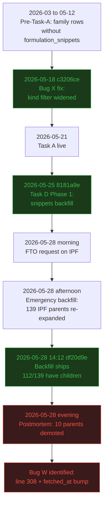
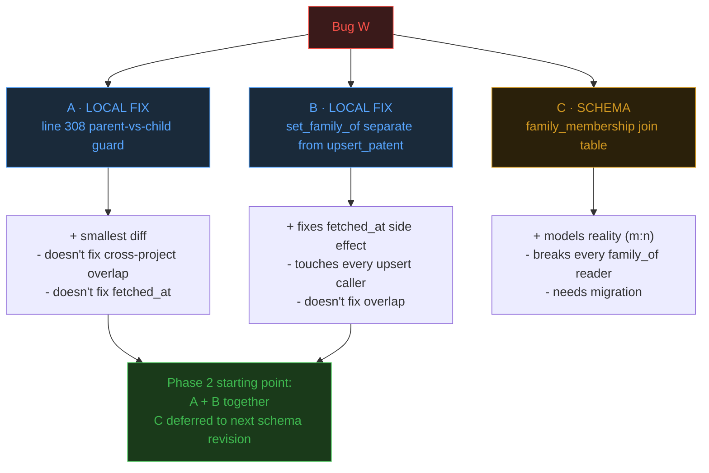

# Bug W (open) — `family_of` single-parent assumption breaks under cross-project overlap

> 存檔備查。實作過程中的微調紀錄在對應的 chat 對話裡。
> 目前不修；待 Task D Phase 2 開動時一併處理。
> 修完後請更新 `docs/architecture.md` 並 rename 為 `bug_W_resolved.md`。

---

## Context

Prior Art Tool 用單一 SQLite DB 儲存多個專案的專利資料。
`patents.family_of` 是 single-valued FK，假設 patent family 之間互斥。
實際 EPO 家族資料存在跨專案 overlap，這個假設不成立。

Bug X 修了 family expansion 的 kind code filter（commit `c3206ce`，2026-05-18），但沒人發現 storage 層還有另一個 bug 在等：跨專案 overlap + first-write-wins 會 silently demote parent → child。

---

## Surfacing

2026-05-28 IPF emergency backfill（commit `df20d9e`）對 139 個 A1/A2 parent 連續做 family expansion 後：

- 預期：140 個 IPF A1/A2 parent（139 at-risk + 1 post-Bug-X）全部維持 `family_of IS NULL`
- 實際：130 個還是 parent，**10 個被 demote 成 child**

10 個 demoted patent 來自 `scratch/probe_ipf_mysteries.py` M3 輸出：

```
US2016250217A1   -> EP2443120A2
WO2016063085A1   -> US2016310493A1
EP2107907A1      -> CA2673214A1
EP1285921A1      -> CA2392580A1
WO2024252334A1   -> WO2024157207A1
... (10 total)
```

所有 10 個都仍有 `search_log` row 連到 IPF project，但 patents table 標它們為別人的 child。同時 `fetched_at` 被覆蓋為今天。

---

## Root Cause

兩個 issue 共同造成：

### Issue 1: `_fetch_and_store_family` line 308 沒檢查 parent 身份

```python
# patent_fetcher.py
existing = get_by_id(member_id)
if existing:
    if not existing.get("family_of"):
        upsert_patent({**existing, "family_of": patent_id})
```

guard 只擋「已被認領」，沒擋「自己是 search-hit parent」。當 EPO 家族 API 回傳 patent B 是 parent A 的家族成員、且 B 本身有 search_log row（是另一個 query 的命中結果）時，這段會 silently demote B。

### Issue 2: `upsert_patent` 無條件 bump `fetched_at`

```python
# patent_store.py
"fetched_at": datetime.now().isoformat(),  # always NOW
```

加上 `ON CONFLICT DO UPDATE SET fetched_at = excluded.fetched_at`，任何 upsert 都會覆蓋時間戳。沒有「只 patch 一個欄位」的路徑。

兩個 issue 複合：Issue 1 觸發不該觸發的 upsert，Issue 2 讓那個 upsert 洗掉歷史時間戳。

---

## Impact

| 受影響 | 程度 | 說明 |
|---|---|---|
| FTO analyzer（今天的 use case） | ✓ 不影響 | `fetch_patents` 回 flat list；analyzer 不查 `family_of` |
| Demoted patent 的 content 欄位 | ✓ 不影響 | `{**existing, ...}` 展開，title/abstract/claims/snippets 保留 |
| `get_family_members()` 反查 | ⚠ 受影響 | 反向查原 parent 會 miss 10 個 |
| `fetched_at` 歷史時間軸 | ⚠ 受影響 | 10 個變成今天 |
| Phase 2 跨專案 backfill | ⚠ 放大 | 跨專案 overlap 機率更高（Acetaminophen 163、Ampicillin 16） |

---

## Timeline



Bug 早就 latent，emergency backfill 一次重 expand 139 個 parent 才放大可見。

---

## Remediation Directions



A 跟 B 互不衝突、可以一起 ship。C 需要 schema migration + 改所有讀 `family_of` 的地方，留下次 schema 改版時談。

---

## Related Observations (not in scope)

三個議題在同次調查浮現，獨立追蹤：

- **Family expansion trigger 不透明**：`_get_or_fetch` 只在 `kind in (A1,A2) AND not family_fetched` 觸發。沒文件，要讀 code 才知道。
- **沒有 family staleness/refresh 機制**：`family_fetched=1` 後不會再 refresh。對 historical analysis ok，對 FTO 監控是 known gap。
- **`backfill_log.notes` 沒記 processed patent_id list**：只記 aggregate count。Phase 2 該設計 per-row detail logging。

---

## Why Not Fixing Today

- FTO use case 不受影響（已透過 flat-list path 驗證）
- Direction C 是 schema 級別問題，需要設計思考
- Direction B 動 `upsert_patent` 影響所有 caller，要 careful audit
- Phase 2 還沒開始；正確介入時機是 Phase 2 planning

---

## Non-Goals

- 不在這份 doc 決定具體 patch 內容（留 Phase 2 spec）
- 不順便修「Related Observations」三項（各自獨立追蹤）
- 不對歷史已被 demote 的 10 個 patent 做 reverse migration（FTO 不受影響、改了會更亂）

---

## References

- Surfacing commit: `df20d9e` (2026-05-28)
- Related fix: `c3206ce` Bug X fix (2026-05-18)
- Code: `modules/patent_fetcher.py` line ~308, `modules/patent_store.py` `upsert_patent`
- Phase 2 will hit this at larger scale: `docs/spec/task_D.md`
- Parallel pattern (operation surfaces bug, same-session probe): `docs/spec/bug_Z_resolved.md`