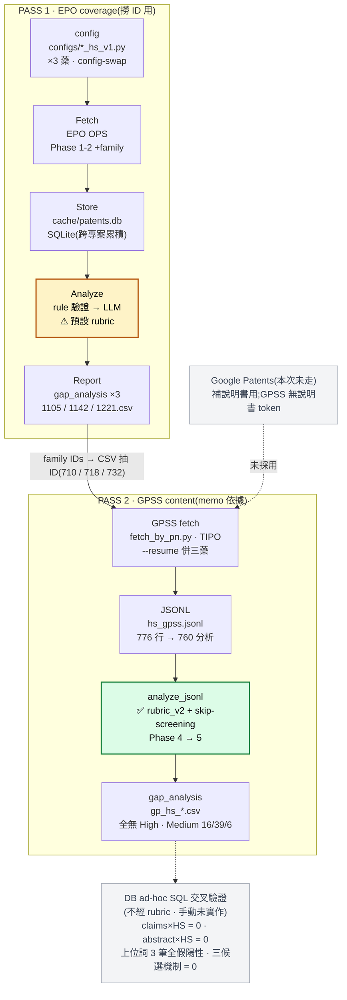

# HS Prior Art 分析 — 開發版流程報告

開發流程紀錄,非交付物。標的:Hidradenitis Suppurativa (HS) × Doxapram / Hydroflumethiazide / Thiothixene。
數字快照:2026-10-02 14:06。

---

## 本次分析流程(對照 Pass 1 / Pass 2 基底)

> 標註重點:**哪一步用哪個 rubric**。Pass 1 的 Analyze 用**預設 rubric**(只為撈 ID,非 memo 依據);Pass 2 的 `analyze_jsonl` 用 **rubric_v2 + skip-screening**,才是 memo 的風險結論來源。第三層 DB 比對完全不經 rubric。



對照你原本的 production flow:PASS 1(config→Fetch→Store→Analyze→Report)與 PASS 2(→ JSONL → analyze_jsonl)結構不變;本次實際走 **GPSS 分支**(非 Google Patents),Report 吐的 family IDs 以各藥 CSV 抽出(710/718/732)餵 Pass 2。

---

## 1. Pass 1 / Pass 2 實作流程

### Pass 1 — EPO(coverage,全自動)

每個藥一輪,config-swap 後跑 `main.py`,全程自動:

```
cp configs/<drug>_hs_v1.py config.py
nohup python3 -u main.py > logs/<drug>_hs.log 2>&1 &
```

| 階段 | 動作 | 產物 |
|---|---|---|
| config | 換 `config.py`(DRUG_ALIASES / INDICATIONS / CUSTOM_QUERIES) | — |
| Phase 1–2 | EPO OPS 搜尋 + family expansion | 專利 + family members |
| Phase 3 | 寫入 `cache/patents.db`(SQLite,跨專案累積) | DB rows |
| Phase 4 | rule / LLM 評分(本次 `gpt-4o-mini` + `gpt-4o`,`USE_LLM` 先 False 驗證再開) | fto_risk / reasoning |
| Phase 5 | 輸出報告 | `output/gap_analysis_*.csv` + `.xlsx` |

- 自動化程度:**全自動**(單一 pipeline)。
- 失敗模式皆為預期:US/CN/CA claims 回 404(licensing,非 bug);EP-A 空殼、全文在 WO sibling。

### Pass 2 — GPSS(better content,半自動)

目的:補 Pass 1 拿不到的 US/CN/TW/JP 全文與 claims(EPO claims 覆蓋僅 ~24%)。

```
CSV ──(1)──> ids.txt ──(2)──> fetch_by_pn.py ──(3)──> analyze_jsonl.py ──> CSV/xlsx
```

| 步驟 | 工具 | 自動化 |
|---|---|---|
| (1) CSV → ids.txt | `tools/csv2ids.py`(utf-8-sig + 偵測 id 欄,--id-col 可覆蓋) | ✅ 工具 |
| (2) GPSS 撈 → JSONL | `gpss-probe/fetch_by_pn.py`(`--resume` 聯集三藥、canary 自檢、miss 不耗配額) | ✅ 腳本 |
| (3) JSONL → Phase 4→5 | `scripts/analyze_jsonl.py`(`_flatten_gpss_envelope` 攤平 GPSS wrapper → flat 欄位) | ✅ 腳本 |

- 三藥共用同一 HS 全掃,故 `--resume` 併進單一 `data/hs_gpss.jsonl`(776 行,760 ok),避免重撈 ~700 landscape。
- GPSS `expFld` **無說明書 token** → 補得了 claims,補不了 description。drug-list 埋在說明書者仍漏(需 Google Patents 那條)。

---

## 2. 分析方法 — 自動化 vs 未自動化

| 工作 | 方式 | 狀態 |
|---|---|---|
| EPO fetch + family + SQLite + rule/LLM 評分 | `main.py` | ✅ 全自動 |
| GPSS 撈取 | `fetch_by_pn.py` | ✅ 腳本(probe 階段) |
| GPSS → analyze flat 轉換 | `analyze_jsonl._flatten_gpss_envelope` | ✅ 已實作 |
| CSV → ids.txt 抽取 | `tools/csv2ids.py` | ✅ 工具 |
| 聯集 filter 回各藥子集 | — | ⚠ 未實作(本次「一起看」略過) |
| 共現檢查(claims×HS、abstract×HS、上位詞) | **ad-hoc SQL** | ❌ 未實作 |
| 假陽性逐筆確認(子字串污染) | **ad-hoc SQL + 人工** | ❌ 未實作 |
| HS 專利地景(機制密度) | **ad-hoc SQL** | ❌ 未實作(標 beta) |
| 數字快照跨源對齊 | 人工 | ❌ 未實作 |
| NPL(PubMed / ClinicalTrials.gov) | — | ❌ 未做 |

### 本次踩到、值得記的坑

- **子字串污染**:機制密度掃描 `il1` 誤中 IL-17/18(IL-1 假性 66→真 22);`d2` 子字串命中 11 筆全為 vitamin D2 / 化合物編號。→ 地景分析若要成工具,關鍵字必須詞界線 `\b`,不能裸子字串。
- **`ta=` claims-only 盲區**:`ta=drug AND ta=HS` 抓不到「新適應症只寫在 claims」的案(architecture.md US9415051B1)。recall 靠 drug-alone 撈進 DB + LLM 讀 claims,殘餘靠 Pass 2。
- **`export_db_to_jsonl` 對最新 cohort 有損**:`family_of IN seeds` 反構漏掉近期案(doxapram 673 vs CSV 710,差 37 筆皆 2024–2026)。Pass 2 的 canonical id 來源應是 Report 的 CSV,不是 DB 反構。

### 數字快照(14:06,主 memo / 地景 doc 同源)

- GPSS 聯集 776 行(760 ok + 16 miss);analyze 扣 16 無內容 → 分析 760 篇。
- 風險分佈(skip-screening + rubric_v2):doxapram 16 Medium / 744 Low;hydro 39 / 721;thio 6 / 754;**全無 High**。
- 共現:claims×HS = 0、abstract×HS = 0;上位詞 3 筆全假陽性。
- 地景:abstract 提 HS 母體 460;三候選機制(鉀通道 / Na-Cl / D2)精確比對 = 0。

---

## 3. 待實作(roadmap)

> 已完成:`CSV → ids.txt` 抽取 → `tools/csv2ids.py`(取代 one-liner)。

1. 聯集 `hs_gpss.jsonl` 依各藥 CSV filter 回子集,供分藥乾淨交付。
2. 共現檢查 + 假陽性過濾(詞界線)收斂成模組,取代 ad-hoc SQL。
3. HS 專利地景機制密度:定義桶 + 詞界線 + test,才從 beta 轉正。
4. NPL 檢索(工具不涵蓋,流程上需補,對可專利性結論權重最高)。
