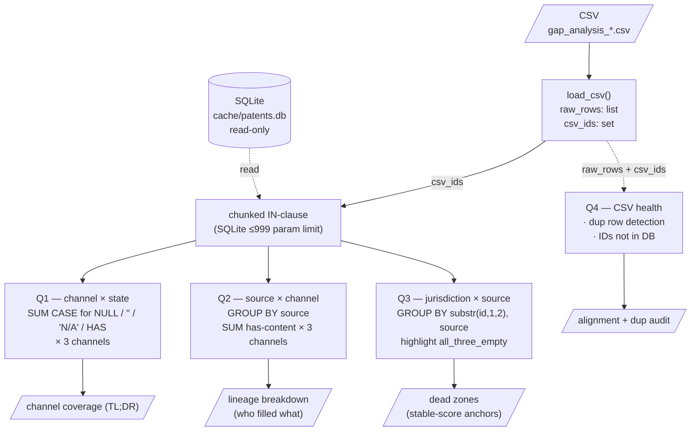

# probe_coverage_v2

Read-only probe that audits how much real content (`abstract`,
`claims`, `examples_extracted`) is present in `cache/patents.db` for
the patent set defined by a risk-analysis CSV.

Use it to:
- Get a one-page coverage summary before / after a destructive backfill.
- Compare coverage across projects to gauge whether an import landed.
- Identify rows that are dead zones (no content in any channel) so you
  know which risk scores should stay stable on re-run.

```bash
python -m tools.probe_coverage_v2 \
    --csv output/gap_analysis_<date>_<time>.csv
```

See `output/coverage_report_pemirolast_20260605.md` for a worked example
and `output/cross_project_coverage_notes.md` for cross-project
comparisons.

---

## For users

### What this tool tells you

For every patent in your CSV, the tool checks the DB and tells you:

1. **Q1 — Channel coverage:** Of the patents in this CSV, how many have
   actual text in `abstract` / `claims` / `examples_extracted`?
2. **Q2 — Lineage breakdown:** Which content came from EPO directly
   versus filled in by a later import (Google Patents)?
3. **Q3 — Dead zones:** Which rows are completely empty (no content
   in any of the three channels)? These rows can't contribute to risk
   scoring.
4. **Q4 — CSV health:** Does your CSV have duplicate rows or patent
   IDs the DB doesn't know about?

You don't need to understand SQL to use this. You do need to understand
what the **four content states** mean.

### The four states of a content field

Every patent in the DB has three content fields (`abstract`, `claims`,
`examples_extracted`). Each field is in one of four states:

| State | What it means |
|---|---|
| **HAS** | Real text content. The patent contributes to risk analysis. |
| **`''`** (empty string) | We tried to fetch this but the source returned nothing usable. The field exists but is empty. |
| **`'N/A'`** | We scraped (e.g. from Google Patents) but the parser couldn't extract content. Different from `''` because we know we *had* something but failed to use it. |
| **NULL** | The field was never written. Usually means the row was created via family expansion and the main fetch path didn't run for it. |

For coverage purposes, all three non-HAS states count as "missing." The
tool reports them separately in Q1 so you can tell *why* they're
missing — `NULL` suggests pipeline gap, `''` suggests source returned
nothing, `'N/A'` suggests parser issue.

### How to read the numbers

A typical good output looks like:

```
abstract: 595/685 has content (86.9%)
claims:   573/685 has content (83.6%)
examples_extracted: 456/685 has content (66.6%)
```

Rough heuristics for what's normal (based on observed projects):

| Channel | Typical pre-import | Typical post-Task-I-style-import |
|---|---|---|
| `abstract` | 80-90% | 80-90% (unchanged — abstract is what EPO gives for free) |
| `claims` | 12-30% | 80-90% |
| `examples_extracted` | 5-10% | 60-70% |

So:

- **`abstract` < 70%** → something's wrong, even EPO usually gives this.
- **`claims` < 30% with no recent import** → expected, EPO licensing
  restricts fulltext for non-EP/WO jurisdictions.
- **`claims` 80%+ after an import** → import landed; expected.
- **`examples_extracted` < `claims`** → expected, examples is a strict
  subset of patents that have a parseable "Examples" section.

### What to do when numbers look weird

| Symptom | Likely cause | Where to look |
|---|---|---|
| Q1 totals don't sum to your expected patent count | CSV has IDs the DB doesn't know about | Q4 will list them; check whether DB was rebuilt after CSV was generated |
| `claims` coverage suddenly drops between runs | Something cleared `claims` in DB | Check `backfill_log`, recent destructive backfills |
| `examples_extracted` = 0 for a jurisdiction that previously had it | EPO fetcher couldn't reach description | Check fetch logs; could be EPO API outage |
| Q4 reports many duplicate patent IDs | Analyzer emitted the same patent twice with different reasoning | Predates Task I; tracked as Phase 4/5 follow-up |
| `mixed_epo_google_patents` source appears in Q2 | Future-import hybrid path triggered | Read Task I spec §"Hybrid case" |

### Common questions

**Q: I'm a pandas person — why isn't this a notebook?**

Coverage probes live in DB land. Loading the whole table into pandas
is fine for small tables, but the CSV id set + DB join pattern is more
direct as SQL. The maintainer section below has pandas-to-SQL
translations if you want to extend it.

**Q: Why does my CSV have 685 distinct IDs but `search_log` only has
369 for the same project?**

Because risk analysis emits family-expansion rows that were never in
`search_log` (family members are added via upsert, not via
`log_search`). The CSV is the authoritative row set for downstream
analysis. See `output/coverage_report_pemirolast_20260605.md` §1 for
the full set arithmetic.

**Q: Can I use this to diff two CSVs from different dates?**

Yes, but **the DB is single-state** — running this on a CSV from May
shows you what those May IDs look like in *today's* DB, not what they
looked like in May. To actually diff coverage over time, you must have
preserved DB snapshots or run the probe contemporaneously with the CSV.

---

## For maintainers

This section is for someone modifying the script. If you're just running
it, the user section above is enough.

### Data flow



ASCII fallback for readers without a Mermaid renderer:

```
       CSV file                cache/patents.db (read-only)
          │                            │
          ▼                            │
     load_csv()                        │
   raw_rows / csv_ids                  │
       │       │                       │
       │       └─→ chunked IN-clause ──┘
       │              │              (chunks of ≤500 IDs to dodge
       │              │               SQLite's IN-clause param limit)
       │              │
       │              ├──→ Q1: SUM CASE × {NULL, '', 'N/A', HAS}
       │              │       × 3 channels → channel coverage
       │              │
       │              ├──→ Q2: GROUP BY source, has-content
       │              │       × 3 channels → lineage breakdown
       │              │
       │              └──→ Q3: GROUP BY substr(id,1,2), source
       │                      + all_three_empty → dead zones
       │
       └──→ Q4: raw vs distinct (dup detection)
              + csv_ids − DB IDs (alignment audit)
```

### Why this shape

- **Q1-Q3 share the same SQL filter** (`WHERE patent_id IN (...)`) on
  the same chunked CSV id set. They differ only in aggregation. Adding
  a Q5 doesn't need new plumbing — reuse `_chunked_in_clause` and write
  the SQL.
- **Q4 doesn't need DB joins for the dup half** (pure CSV
  arithmetic). It runs cheaply alongside Q1-Q3 because it catches data
  problems that would silently corrupt the other queries' results.
- **DB is opened read-only via SQLite URI mode** (`file:...?mode=ro`).
  No write surface; the probe cannot mutate the cache.

### Six SQL idioms used in this script

If you're more comfortable with pandas than SQL, these are the things
that look unfamiliar and what they map to.

**1. `SUM(CASE WHEN cond THEN 1 ELSE 0 END)` — counting matching rows**

```sql
SELECT
    SUM(CASE WHEN abstract IS NULL THEN 1 ELSE 0 END) AS null_count,
    SUM(CASE WHEN abstract = ''    THEN 1 ELSE 0 END) AS empty_count
FROM patents
```

Pandas equivalent:

```python
df['abstract'].isna().sum()
(df['abstract'] == '').sum()
```

The SQL form computes multiple counts in one pass. In pandas you'd
either scan the column multiple times or use `value_counts` and slice.
Same answer, different ergonomics.

**2. `IN (subquery)` instead of `JOIN` — preventing fan-out**

We use:

```sql
WHERE patent_id IN (SELECT DISTINCT patent_id FROM search_log WHERE project = ?)
```

NOT:

```sql
FROM patents p JOIN search_log sl ON sl.patent_id = p.patent_id
WHERE sl.project = ?
```

Reason: `search_log` has multiple rows per `patent_id` (one per query
that matched). A JOIN multiplies result rows by the join cardinality,
inflating `SUM(CASE)` counts. `IN (subquery)` filters without
multiplying. This bug bit us during development — see
`output/coverage_report_pemirolast_20260605.md` §1 for the full story.

Pandas equivalent of the correct form:

```python
df[df['patent_id'].isin(project_ids)]
```

**3. `COALESCE(col, '') IN ('', 'N/A')` — three-state missing check**

```sql
SUM(CASE WHEN COALESCE(claims, '') IN ('', 'N/A') THEN 1 ELSE 0 END)
```

This is "claims is missing in any of three ways: NULL, empty string, or
the `'N/A'` sentinel."

`COALESCE(col, '')` converts NULL into `''`. Then `IN ('', 'N/A')`
catches the two missing-string states. The shorter `col IS NULL OR
col = ''` misses the `'N/A'` case, which Task I introduced.

Pandas equivalent:

```python
df['claims'].fillna('').isin(['', 'N/A'])
```

**4. Chunked IN-clause — dodging SQLite's parameter limit**

SQLite's default max parameters per query is 999. Our id sets can hit
that. The helper `_chunked_in_clause` splits the id list into chunks of
500 and unions the results in Python:

```python
for i in range(0, len(ids), chunk):
    batch = ids[i:i + chunk]
    placeholders = ",".join("?" * len(batch))
    sql = sql_template.format(placeholders=placeholders)
    out.extend(conn.execute(sql, (*batch, *extra_params)).fetchall())
```

Each chunk is a complete query; results merge in Python. For Q1-Q3
this means **the merge happens after all chunks return**, so don't
rely on intermediate SUMs in mid-loop. The aggregation logic re-sums
across chunks explicitly (see `q1_channel_state`, `q2_lineage_xtab`).

**5. `substr(patent_id, 1, 2)` — extracting jurisdiction from ID**

Patent IDs encode jurisdiction in the first two characters:
`US123...`, `EP456...`, `CN789...`. SQLite's `substr` is 1-indexed and
takes (string, start, length). This is the cheapest way to bucket by
country without joining a jurisdiction table.

Pandas: `df['patent_id'].str[:2]`.

**6. Read-only SQLite URI**

```python
conn = sqlite3.connect(f"file:{p.as_posix()}?mode=ro", uri=True)
```

The `uri=True` flag makes sqlite3 treat the first argument as a URI
rather than a filesystem path. `?mode=ro` opens the file read-only.
This is **defensive**: even if a bug introduced a write statement, the
DB would reject it. Don't remove the URI mode just to clean up the
connection code.

### Intentionally omitted

Things this script could do but doesn't, and why:

- **No ORM** (SQLAlchemy etc.). This is a probe — SQL should be visible
  as documentation, not abstracted behind an ORM layer.
- **No unit tests in repo**. Fixture-driven testing was done during
  development (see this tool's chat history); when changing SQL, write
  a fresh fixture covering the cases you care about. The schema is
  stable enough that drift detection isn't worth a test harness.
- **No incremental caching**. Every run scans the full CSV id set;
  685 rows finishes in <1s. Caching adds complexity for no measurable
  win.
- **No CSV-to-CSV diff feature**. "Compare two CSVs" is really
  "compare two DB states reflected through two CSVs," but the DB is
  single-state — running this against an old CSV and a new CSV gives
  you results that both reflect *current* DB. To do a real
  before/after diff, you need preserved DB snapshots. The probe stays
  point-in-time on purpose; the cross-project comparison pattern
  (`output/cross_project_coverage_notes.md`) is the supported
  workaround.

### Tripwires — don't change these without understanding why

- **Q1's `total` column.** It's `COUNT(*)`, not `COUNT(DISTINCT
  patent_id)`. Both happen to give the same answer because we filter
  via `IN (subquery)` on a distinct ID set — but if you change the
  filter to a JOIN, `COUNT(*)` becomes fan-out-inflated and you won't
  notice until the percentages are wrong.
- **Q4 runs even when `--query 1` is requested.** Don't gate Q4 on
  the `--query` flag. Q4 catches the data problems (CSV dups, IDs not
  in DB) that would silently corrupt Q1-Q3.
- **`load_csv` returns BOTH `raw_rows` and `csv_ids`.** Don't simplify
  to just `csv_ids` — Q4 needs the raw list to detect duplicates.
- **Adding a new channel (e.g. a hypothetical `description` field)
  requires changes in THREE places**: Q1's `channels` list, Q2's
  SELECT clause, Q3's SELECT clause and `all_three_empty` formula.
  There's no shared definition; this is intentional to keep each
  query self-contained, but it means the channel list isn't DRY. If
  you add a channel, search for `examples_extracted` and add the new
  field everywhere it appears.
- **`mixed_epo_google_patents` source value.** Q2 specifically checks
  if this appears with a non-zero count and prints a note. This is a
  canary for Task I's hybrid code path (which didn't trigger in the
  real run per the spec). If you remove the check, future hybrid
  triggers will be silent.

### Adding a Q5

If you want to add a new query (e.g. `Q5 — year × channel coverage`):

1. Write a `q5_year_breakdown(conn, csv_ids)` function following the
   same shape as `q3_still_empty`.
2. Use `_chunked_in_clause` with a SQL template that has `{placeholders}`
   in the WHERE clause.
3. Aggregate results across chunks in Python (don't expect a single
   query to return the final answer).
4. Add `"5"` to the `--query` choices in `main()` and wire it up.
5. Update the data flow diagram and the four-outputs table in this
   doc.
